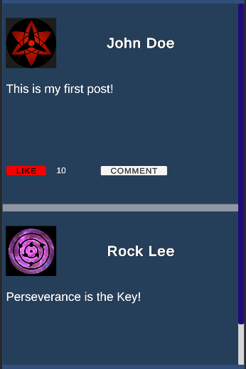
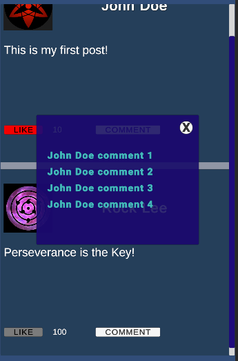
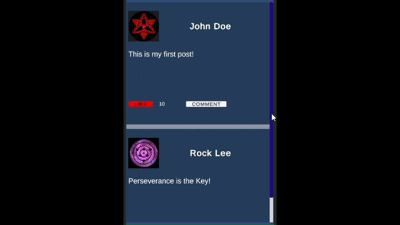

# Simple Social Post Viewer
A Unity project that demonstrates a basic social media-style post UI, created as part of the Unity Assignment.

## 📋 Project Overview
This project simulates social media post using Unity’s UI system. It displays a user name, profile picture, post content, and a like button that toggles between liked and unliked states. The post uses dummy data, and the like count updates interactively. The project is designed to showcase skills in Unity UI, basic C# scripting, and handling user interactions.

## 🎯 Features
* Social Media Post UI:
  * User Name (text)
  * Profile Picture (placeholder image)
  * Post Content (dummy text)
  * Like Button (toggles state and updates like count)

* Basic Logic:
  * Like button changes appearance when clicked
  * Like count increases/decreases with button state

* Dummy Data:
  * Hardcoded post data (can be adapted for JSON or ScriptableObject)

## 🛠️ Tools & Technologies
* Unity 2022.3.51f LTS
* Unity UI Components (Canvas, Image, Text, Button)
* C# Scripting
* No third-party plugins

## 💡 What I Learned
* ### Unity UI System:
Gained hands-on experience with Canvas, layout groups, and UI components to create clean, interactive interfaces.

* ### C# Scripting for UI:
Learned how to connect UI elements to scripts, update UI dynamically, and handle user input events.

* ### State Management:
Implemented simple logic to toggle UI states (like button) and update related data (like count).

* ### Project Organization:
Practiced structuring a Unity project for clarity and maintainability.

## 🖼️ Screenshots

## Demo Video

## How to Run
1. Clone or download this repository.
2. Open the project in Unity 2022.3.51f LTS.
3. Open the **MainScene** and press Play to view the demo.

## 📦 Assignment Reference
This project fulfills the requirements outlined in the Unity Assignment:
* Simulates a social media post using Unity UI.
* Demonstrates basic scripting and interaction handling.
* Uses dummy data for display.
* Focuses on clean, functional implementation.

## 📝 Notes
* The project is intentionally simple and focused on core requirements.
* Optional bonus features (multiple posts, comments, persistent likes, animations) can be added as extensions.

##
Thank you for reviewing my project!
